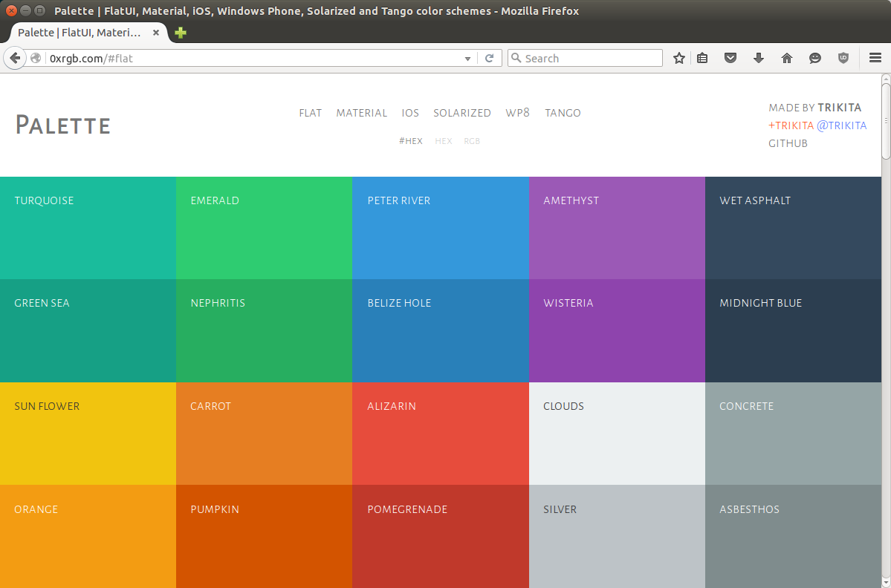
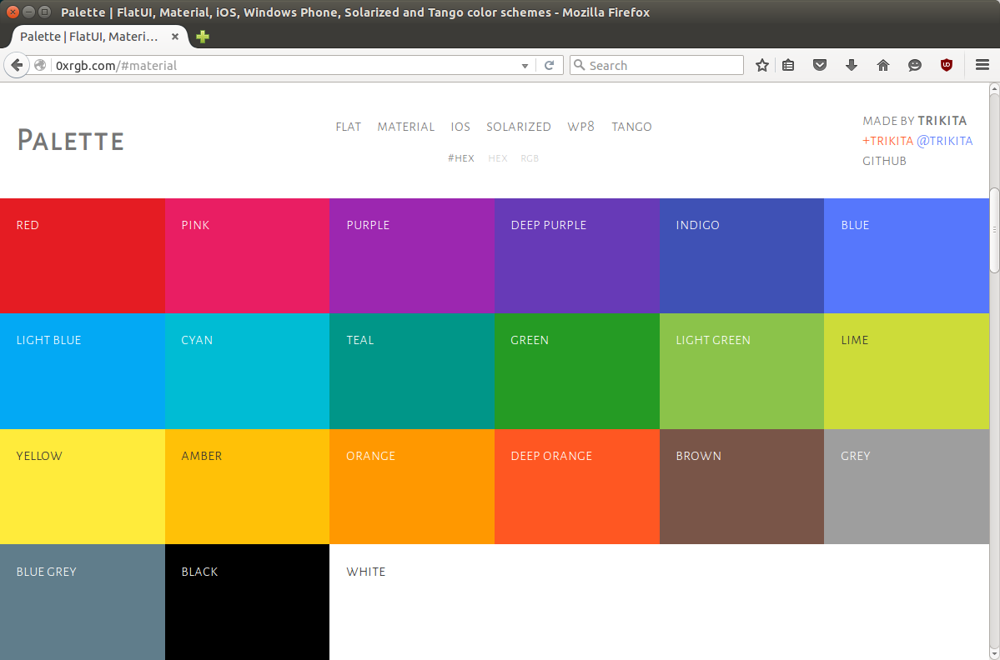

# Palette

http://0xrgb.com - a minimal color picker that does not use Adobe Flash.

## Features

* All popular color palettes in one place: - Material (Android) - iOS 7/8 -
	Metro (Windows Phone 7/8) - FlatUI - Solarized - Tango (Gnome)
* HTML5 Clipboard API to copy color values into the clipboard
* Works well enough if your browser doesn't support HTML5 Clipboard API yet
* Works well enough even without javascript (e.g. with NoScript enabled)
* Open source

## Screenshots

## Why another one color picker?

In our apps we often use colors from some well-known palettes. If we make an
Android app - we follow material guidelines, if we make a hipster webapp - we
use calm FlatUI colors etc.

Now we have one tiny web page aggregating all popular palettes. Btw, if there
is a famous palette that is missing in our list - let us know!

But the bigger problem is the way how other pickers work. As of 2015 they all
suck because they use Adobe Flash.  In fact, they only use Flash to copy
hexadecimal color value into the clipboard! Firefox disabled flash and I
personally perfer to disable it in Chrome. This makes all other pickers
useless.

We now have HTML5 Clipboard API. It works fine in recent Chrome and Firefox. We
dared to become the first color picker webapp to use HTML5 instead of Flash.

## Fallback gracefully

If you have Chrome of Firefox - just click on the color tile and the value will
be copied into your clipboard. You should see an animation confirming your
selection.

If you have other browsers - most likely the color value will be shown and
selected after the click. You only have to manually press Ctrl+C. This is how
Trello deals with clipboard and it seems to be a good compromise between being
useful and being Flash-less.

If you are paranoid and don't have JavaScript enabled - we will show you all
the color values at once. You can double-click and press Ctrl+C to select the
color.

## License

Made by @zserge and @krugloid.
Distributed under MIT license.
Any feedback is welcome!

